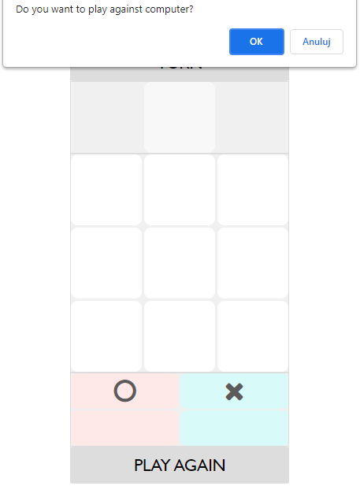
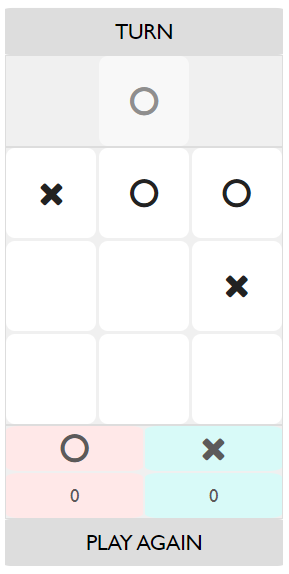
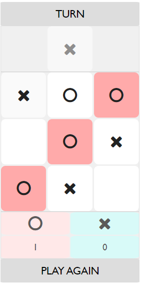

# Tic-tac-toe Game with Computer AI

## Description

This is a simple implementation of the classic Tic-tac-toe game using plain JavaScript. The game allows you to play against the computer AI and keeps track of the total score of the games played. You take turns marking X and O on a 3x3 grid. The objective of the game is to be the first player to form a horizontal, vertical, or diagonal line with their respective marks.

## Features

- Play against the computer AI
- Interactive and user-friendly interface
- Highlights the winning line when a player wins the game
- Allows for a new game to be started after the current game ends
- Keeps track of the total score of the games played

## How to Play

1. Open the `index.html` file in your web browser.
2. Click on an empty cell on the game grid to make your move.
3. The computer AI will automatically make its move.
4. The first player to form a line of their respective marks (X or O) wins the game.
5. If all cells are filled and no player has formed a line, the game ends in a draw.
6. The total score is displayed at the bottom of the page.
7. To start a new game and play again, click the "PLAY AGAIN" button.
   
## Technologies Used

- JavaScript
- HTML5
- CSS3
  
## Presentation

### Start

### Play mode

### End game

Enjoy playing Tic-tac-toe!

